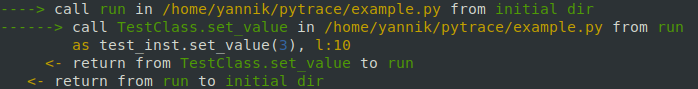

# pytrace

Get information on python program execution (e.g. functions called, lines executed) at runtime.

# Installation

```
pip install git+https://github.com/yrath/pytrace.git
```

# Examples

The tracer can be created as a context manager as follows:

```
import os
from pytrace.tracer import trace_execution

class TestClass(object):
    def set_value(self, value):
        self.value = value

def run():
    test_inst = TestClass()
    test_inst.set_value(3)

with trace_execution(traced_paths=[os.path.abspath(__file__)]) as tracer:
    run()
```

which will output


